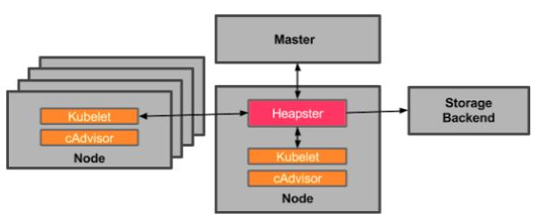
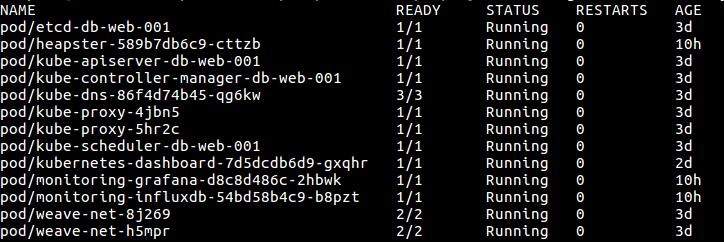
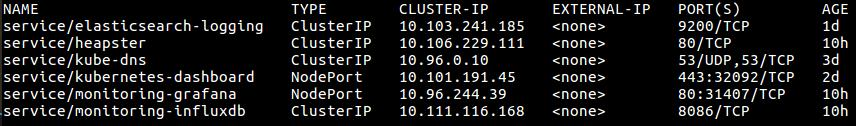
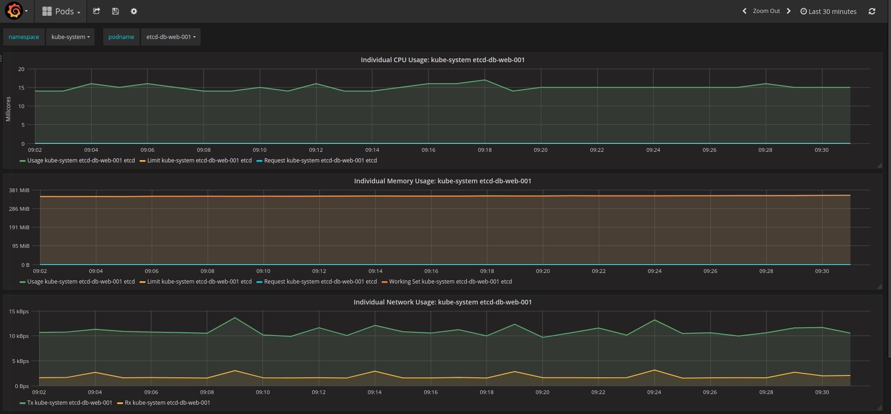

## Heapster
* Monitoring solution
* pod로 동작하므로 쿠버네티스 자체체서 관리가 가능
* 클러스터내 모든 노드에서 운영 메트릭과 이벤트 정보를 수집
    * persistent storage backend에 저장하고, web으로 시각화
    * InfluxDB와 Grafana 조합을 heapster 레포지토리에서 기본으로 제공
    * InfluxDB 대신 구글의 Prometheus도 괜찮아 보임.
    * Grafana대신 new relic이나 Datadog이 더 나아 보임.
* cAdvisor
    * 모든 노드에서 동작하는 kubelet의 구성 요소.
    * 각 컨테이너의 CPU/core 사용량, 메모리, 네트워크, 파일 시스템 정보를 수집
    * 위의 모든 정보를 kubelet을 통해 제공 -> Heapster
    * 이런 류의 데몬들은 데이터를 샘플링해서 보내기 때문에 부정확할 가능성도 있음.



* Usage

    저는 on-premise 환경에서 실험했습니다. Heapster+InfluxDB+Grafana 조합입니다.
kubernetes 1.10.2 버전입니다. 
1. heapster 레포지토리에서 1.5.3 release를 다운 받습니다.
2. 설치 
~~~
$ cd heapster-1.5.3/deploy
$ ./kube.sh start
$ kubectl edit service monitoring-grafana -n kube-system     //type: ClusterIP를 type: NodePort로 변경합니다.
~~~





3. Grafana 접속 
http://node-ip:node-port 로 접속이 가능합니다.(grafana pod가 어떤 node에 올라가 있는지 확인해야 합니다.)
혹시 external-ip 잡는 것이 어려우면 아래의 방법을 사용합니다.  
~~~
$ kubectl cluster-info
~~~
위의 명령을 주면 



사진처럼 grafana의 api 주소를 알 수 있을텐데, proxy를 열어서 위의 api를 입력하면 접속이 가능합니다.
~~~
$ kubectl proxy --address=’node ip address’ --accept-hosts=’regex for hosts that the proxy should accept’ --port=’node port’   // proxy 여는 방법
~~~



## Reference
* 쿠버네티스 마스터 (책)
* Kubernetes 공식 doc & repository
* 페이스북 Kubernetes & Docker 공식 그룹