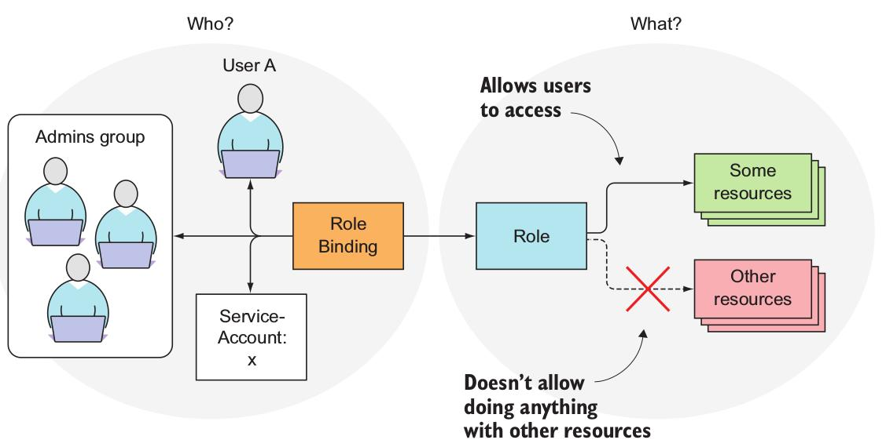
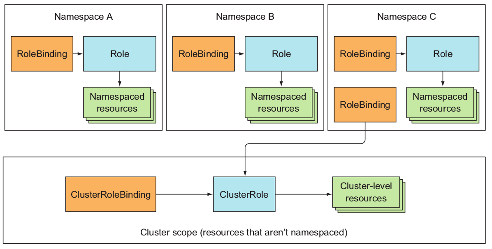

## ServiceAccount

## ServiceAccount와 authorizaion(인가)
각 pod에 다른 ServiceAccount를 할당함으로써 pod가 접근하는 클러스터 자원들을 컨트롤할 수 있다. 
API 서버가 인증 토큰을 포함하는 요청을 수신하면, 서버는 토큰을 사용하여 요청을 보내는 클라이언트를 인증 한 다음 관련 ServiceAccount가 요청 된 작업을 수행 할 수 있는지 여부를 결정한다. API 서버는 이 정보를 system-wide 인가 플러그인을 통해 얻을 수 있다. 그 중 하나가 RBAC(role-based access control)이다.

## 왜 ServiceAccount가 필요할까?
클러스터 security 때문이다. 클러스터의 metadata나 어떤 자원에 접근할 필요가 없는 pod의 경우, 그것들에 접근할 수 없는 ServiceAccount를 할당하면 된다. 클러스터의 자원에 대한 read only 권한만 필요한 경우, read only만 할 수 있는 ServcieAccount를 할당하면 된다. 이러한 방식으로 클러스터의 security를 보장한다.

## ServiceAccount 생성
~~~
$ kubectl create sa foo
serviceaccount "foo" created
$ kubectl describe sa foo
Name:                foo
Namespace:           default
Labels:              <none>
Annotations:         <none>
Image pull secrets:  <none>
Mountable secrets:   foo-token-6zqx5
Tokens:              foo-token-6zqx5
Events:              <none>
$ kubectl describe secret foo-token-6zqx5
Name:         foo-token-6zqx5
Namespace:    default
Labels:       <none>
Annotations:  kubernetes.io/service-account.name=foo
              kubernetes.io/service-account.uid=727b61b0-5c8a-11e8-a85a-a0481c8983a8

Type:  kubernetes.io/service-account-token

Data
====
token:      eyJhbGciOiJSUzI1NiIsImtpZCI6IiJ9.eyJ...
ca.crt:      1025 bytes
namespace:   7 bytes
~~~
* custom token Secret이 자동으로 생성된 것을 확인할 수 있다.
* ServiceAccount의 token은 JWT 토큰이다.
* Mountable secrets
    * pod는 어떤 Secret든 마운트할 수 있다.
    * ServiceAccount를 사용하면 `Mountable secret`에 명시된 secret들만 pod에 마운트할 수 있게 제한할 수 있다.
    * ServiceAccount에 `kubernetes.io/enforce-mountable-secrets="true"`라는 annotation을 추가하면 이 기능을 사용가능하게 된다.
* Image pull secrets
    * private container image repository에서 image를 가져오기 위한 credential을 가지는 `Secret`이다.
    * Mountable secret처럼 어떤 image pull secret를 pod가 사용할 수 있을지 결정하는 것이 아니라, 명시된 모든 image들을 자동으로 모든 pod에 추가한다. => 필요한 image가 추가될 때 마다 모든 pod를 돌아다니면서 추가해줄 필요 없이 자동으로 추가해준다.
* 이 두 가지 설정으로 cluster security를 어떻게 보장하는지는 잘 모르겠다...

## pod에 ServiceAccount 할당
* pod를 생성하기 전에 .yaml 파일에서 `spec.serviceAccountName`에 사용할 ServiceAccount의 이름을 정의해 주어야 한다.
    * pod가 생성된 이후에는 수정할 수 없음.
    * 예시: curl-custom.yaml
    ~~~
    apiVersion: v1
    kind: Pod
    metadata:
        name: curl-custom-sa
    spec:
        serviceAccountName: foo
        containers:
        - name: main
          image: tutum/curl
          command: ["sleep", "9999999"]
        - name: ambassador
          image: luksa/kubectl-proxy:1.6.2
    ~~~
* ServiceAccount는 mountable Secret 또는 image pull Secret만 제공하기 때문에, 적절한 인가 플러그인이 없으면 사실상 default ServiceAccount를 사용하는 것과 큰 차이가 없다.
* RBAC 플러그인을 사용할 때 추가적인 ServiceAccount를 사용하는 것은 필수!

## RBAC(role-based access control)
* authorization plugin을 사용하는 이유: action을 요청하는 사용자가 action을 수행할 수 있는지 여부를 확인하기 위해
* actions
    * API server로 rest를 통해 요청하므로 GET, POST, PUT 등의 `verb`로 특정 `리소스`를 표현하는 url path에 요청
    * 예를 들면 get pods, create services,update secrets 등
* 간단하게 생각해봤을 때, user는 자신이 가지는 role이 허용하는 모든 것을 할 수 있다.
    * update Secret에 대해 어떤 사용자도 role을 가지고 있지 않다면, API server는 secret에 대한 put 또는 patch 요청을 막을 것이다.

### RBAC in kubernetes


* Roles and ClusterRoles: 어떤 리소스에 어떤 action이 사용가능한지 명시 
* RoleBindings and ClusterRoleBindings: Roles and ClusterRoles를 누구(users, groups, serviceaccount)에게 할당할지를 명시



* Role과 RoleBinding은 namespaced resource이고, ClusterRole과 ClusterRoleBinding은 Cluster-level resource
* 4가지 모두 multiple로 생성가능하고 RoleBinding을 ClusterRole이 참조가능하다.

### Roles and RoleBindings

