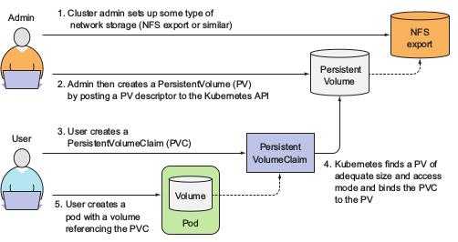

* pod의 component
* standlone object가 아님.
* access하고 싶으면 container에 마운트 해주어야 함.

## Volume types
* emptyDir: 일시적인 데이터를 저장하는 단순 empty 디렉토리
* hostPath: worker 노드의 파일 시스템의 디렉토리를 pod에 마운팅시킬 때 사용
* gitRepo:
* nfs
* gcePersistentDisk, awsElasticBlockStore, azureDisk
* cinder, cephfs, iscsi, flocker, glusterfs, quobyte, rbd, flexVolume, vsphereVolume, photonPersistentDisk, scaleIO: 여러 종류의 네트워크 스토리지를 마운트시킬 때
* configMap, secret, downwardAPI: 쿠버네티스 자원과 클러스터 정보를 포드로 노출시킬 때
* persistentVolumeClaim: preprovision되거나 dynamic하게 provisioning할 수 있는 영구 스토리지
* 하나의 pod는 다른 type의 여러개의 volume을 마운트 가능하다.
* pod에 속한 컨테이너들은 volume을 마운트할 수도 있고 안할 수도 있음.

## volumes between containers in same pod
### emptyDir
* temporary storage -> pod가 죽으면 내용이 날아가는 volume
* conatiner의 파일 시스템에 그냥 쓰는 것과 차이점?
  * container의 파일 시스템이 not writable할 때가 있음. 이건 찾아봐야 할 듯 함.
* tmpfs에 emptyDir을 올릴 수 있음
~~~
volumes:
  - name: html
    emptyDir:
      medium: Memory     //이 option을 주면 tmpfs로 사용 가능
~~~

## Accesing files on the worker node's filesystem
### hostPath
* persistent storage
* it makes the pod sensitive to what node it's scheduled to
* node의 데이터(log file, kubeconfig, CA certificates)에 접근할 때 쓰임
* only if you need to read or write system files on the node. never use them to persist data across pods.

## Using persistent storage
* pod가 다른 노드로 reschedule되더라도, 접근할 수 있는 영구 저장소(NAS)
### NFS
~~~
volumes:
- name: mongodb-data
  nfs:
    server: 1.2.3.4    //ip주소
    path: /some/path   //경로
~~~

## Decoupling pods from the underlying storage technology
* 개발자가 인프라의 정확한 정보를 알아야한다는 점에서 앞에서 다루었던 volume들은 kubernetes의 basic idea를 거스른다. kubernetes는 어플리케이션과 개발자가 실제 인프라에 대한 정보없이 데이터센터에서 운용가능하도록 하는 것이 목적이다.
* 개발자는 그냥 필요한 정도의 storage를 kubernetes에 request하면 쓸 수 있다. 물론 cluster admin이 잘 준비해놔야겠지만
* 여기에 사용되는 것이 PersistentVolumes PersistentVolumesClaims
### Introducing
 

