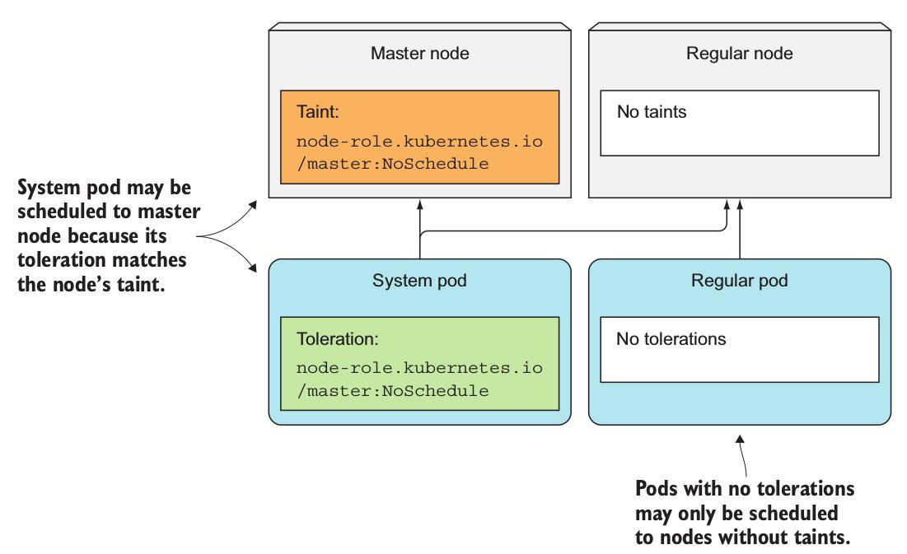

# Taints and Tolerations
* 어떤 pod들이 특정 node로 스케줄되도록 강제할 수 있는 기능

## Master node
* 대표적으로 Master node가 taint로 되어 있음.
    * 그래서 Contral Plane이 Master node로만 스케줄 됨.

~~~
// Master node를 확인해 보자.
$ kubectl describe node master.k8s
Name:             master.k8s
Role:
Labels:           beta.kubernetes.io/arch=amd64
                  beta.kubernetes.io/os=linux
                  kubernetes.io/hostname=master.k8s
                  node-role.kubernetes.io/master=
Annotations:      node.alpha.kubernetes.io/ttl=0
                  volumes.kubernetes.io/controller-managed-attach-detach=true
Taints:           node-role.kubernetes.io/master:NoSchedule
~~~


 
* Taint는 `<key>=<value>:<effect>` 로 구성되어 있음.
* 위의 예제에서 `key`는 `node-role.kubernetes.io/master`, `value`는 null, `effect`는 `NoSchedule`이다.
* master의 taint는 다른 pod들이 master node로 스케줄되는 것을 막고, tolerate된 pod들만 master로 스케줄되게 한다.
* master의 taint와 동일한 toleration을 갖는 pod(system pod)만 master로 스케줄된다.

### Effects
* Taint와 Toleration의 `effect`는 3가지 종류를 가진다.
    * `NoSchedule`: 스케줄할 pod가 특정 taint를 가지는 node와 같은 toleration을 가지고 있지 않으면, 해당 node에 이 pod를 스케줄하지 않는다.
    * `PreferNoSchedule`: 기본적으로 이 effect를 가진 taint를 가지는 node에 pod를 할당하지 않지만, pod를 할당할 곳이 없으면 taint를 가진 node라고 하더라도 할당한다.
    * `NoExecute`: toleration이 없는 pod가 할당된 node에 `NoExcute`를 추가하면, toleration이 없는 pod를 제외시킨다. 즉, 이 effect는 pod의 스케줄링뿐만 아니라 현재 실행 중인 pod에까지 영향을 미친다.

### Usage
* node에 taint 추가하기.
~~~
$ kubectl taint node node1.k8s node-type=production:NoSchedule
~~~
 
* pod에 toleration 추가하기.
* deployment를 만들 *.yaml 파일에 `tolerations` 옵션으로 추가.
~~~
apiVersion: extensions/v1beta1
kind: Deployment
metadata:
    name: prod
spec:
    replicas: 5
    template:
        spec:
            ...
            tolerations:
            - key: node-type
              Operator: Equal
              value: production
              effect: NoSchedule
~~~