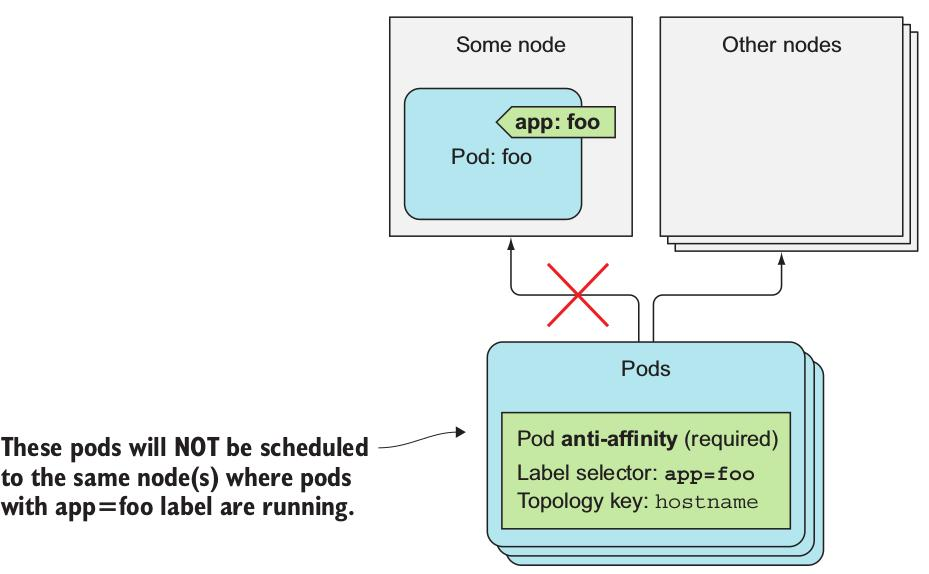

# Node Affinity
* pod들을 특정 node들의 서브셋에 스케줄되게 할 수 있는 기능.
* 특정 pod가 특정 node들로 스케줄되게 하고, 만약 불가능할 경우 다른 node로 스케줄되게 하는 식의 방법

## Node selector와 Node Affinity 비교
* gpu가 있는 node에만 할당되는 pod에 대한 .yaml 파일 비교
~~~
//nodeSelector in pod's .yaml. gpu=true라는 label이 있는 node에만 할당
...
spec:
  nodeSelector:
      gpu: "true"
...
//nodeAffinity in pod's .yaml.
spec:
   affinity:
       nodeAffinity:
           requiredDuringSchedulingIgnoredDuringExecution:
               nodeSelectorTerms:
               - matchExpressions:
                   - key: gpu
                     operator: In
                     values:
                     - "true"
~~~

## Hard requirement
* requiredDuringSchedulingIgnoredDuringExecution
    * requiredDuringScheduling: pod가 할당될 node가 가져야할 label에 대한 규칙을 여기에 명시하겠다.
    * ...IgnoredDuringExecution: 여기에 명시된 규칙은 node에서 이미 실행되고 있는 pod에 영향을 미치지 않는다.
        * 근데 아직 쿠버네티스에서 affinity는 실행 중인 pod에 아무 영향을 주지 못함. 즉, 모든 affinity는 `IgnoredDuringExecution`으로 끝나야 한다. 
        * 나중에 지원할 계획이라고 한다.
* nodeSelectorTerms and matchExpressions


 
## Preference requirement
~~~
// *.yaml file
...
spec:
    affinity:
        nodeAffinity:
            preferredDuringSchedulingIgnoredDuringExecution:
            - weight: 80
            preference:
                matchExpressions:
                - key: availability-zone
                operator: In
                values:
                - zone1
            - weight: 20
            preference:
                matchExpressions:
                - key: share-type
                operator: In
                values:
                - dedicated
...
~~~
 


* preferredDuringSchedulingIgnoredDuringExecution
    * 특정 pod를 스케줄할 때 Scheduler가 어떤 노드를 먼저 선택하는 것이 나은지 명시. preference라고 부른다.
    * preference requirement라고 한다. requiredDuringScheduling은 hard requiremnet라고 한다.
    * 위의 yaml에 `replica`를 5로 설정하고 pod deployment를 생성하면, 각자 다르겠지만, weight 80에 4개, weight 20에 1개의 pod를 생성한다.
    * Scheduler가 스케줄할 때 affinity말고 다른 것들을 사용하기 때문이다. 그 중 하나가 `SelectorSpreadPriority`이다.
    * `SelectorSpreadPriority`는 pod가 같은 ReplicaSet 또는 Service에 몰리지 않게 해서, cluster가 node failure에 강하게 만드는 역할을 한다.
    * 만약 affinity를 설정하지 않으면, 최대한 반반씩 나눈다.

# Pod Affinity
* pod간에 affinity 필요할 땐?
    * 어떤 경우가 있을까? backend, frontend pod가 있다고 하면 두 pod가 가까이 있는 것이 좋을텐데, 이런 경우 필요!
* backend, frontend pod가 같은 node에 있는 경우 예시
~~~
// backend pod 생성
$ kubectl run backend -l app=backend --image busybox -- sleep 999999
~~~
~~~
// frontend pod 생성 with podAffinity
apiVersion: extensions/v1beta1
kind: Deployment
metadata:
    name: frontend
spec:
    replicas: 5
    template:
        ...
        spec:
            affinity:
                podAffinity: // podAffinity
                    requiredDuringSchedulingIgnoredDuringExecution: // hard requirement
                    // selector와 매칭된 pod와 같은 node에서 실행
                    - topologyKey: kubernetes.io/hostname
                      labelSelector:  // namespace 추가하면 다른 namespace의 pod에도 가능
                        matchLabels: //matchExpression 사용 가능
                          app: backend

...
~~~
* 5개의 frontend pod 모두 backend pod가 할당된 node에 생성된다.


* 특정 label을 가진 pod와 같은 AZ에 속하게 만들기
    * topologyKey: failure-domain.beta.kubernetes.io/zone

* 특정 label을 가진 pod와 같은 region에 속하게 만들기
    * topologyKey: failure-domain.beta.kubernetes.io/region

* topologyKey 설명


* podAffinity도 preferredDuringSchedulingIgnoredDuringExecution를 사용해 preference requirement 사용 가능 하다. 아래와 같은 방식으로 nodeAffinity처럼 사용하면 된다.
~~~
apiVersion: extensions/v1beta1
kind: Deployment
metadata:
    name: frontend
spec:
    replicas: 5
    template:
        ...
        spec:
            affinity:
                podAffinity:
                    preferredDuringSchedulingIgnoredDuringExecution:
                    - weight: 80
                      podAffinityTerm:
                        topologyKey: kubernetes.io/hostname
                        labelSelector:
                            matchLabels:
                                app: backend
    containers: ...
~~~

# Anti-affinity
* 어떤 pod들이 서로 떨어졌으면 좋을 때 사용할 수 있다.
* 어떤 pod들이 서로의 performance에 큰 영향을 줄 수 있을 때, 어떤 종류의 pod들이 다른 AZ 또는 region에 있었으면 할 때 사용하면 될 듯 하다.
* .yaml에서 `podAffinity`를 `podAntiAffinity`로 바꿔쓰면 된다.
* 위의 frontend 예제에서 frontend pod끼리 anti-affinity를 주면 두 개의 node에 pod가 각각 하나씩 생기고, 남은 3개의 pod는 `pending`상태가 된다.
* anti-affinity도 역시 preference requirement가 사용가능하다. 


